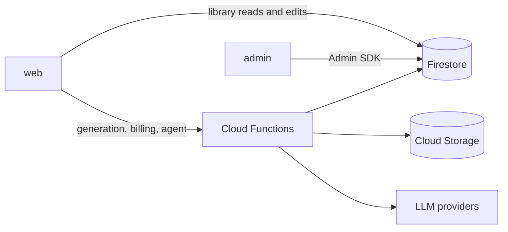
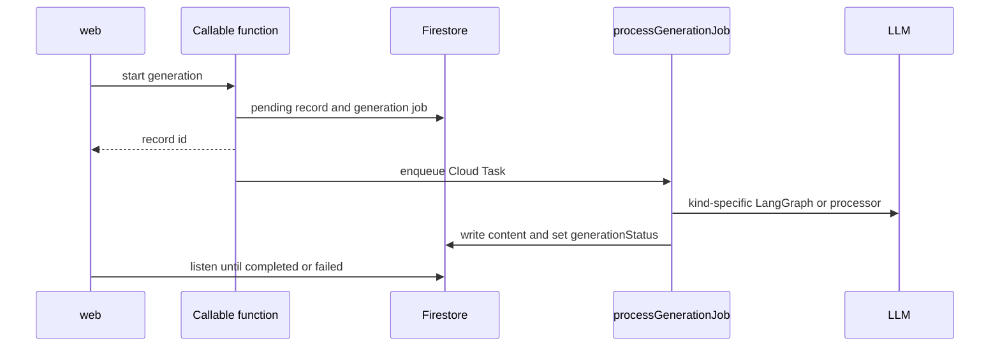
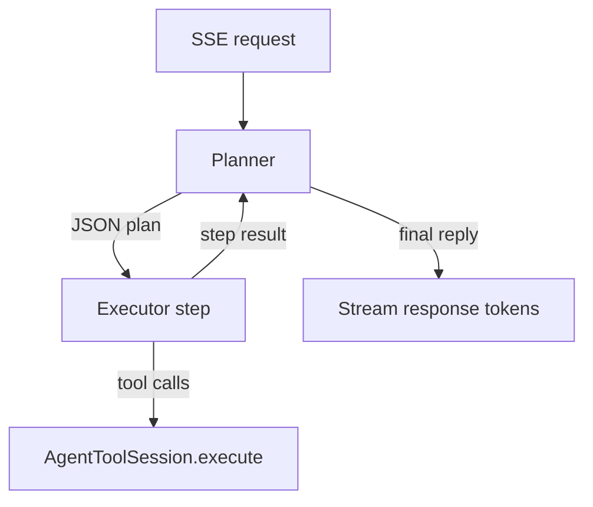

# StudyForge

AI-powered study platform. Organize source documents in directories, attach rules to steer generation, and produce artifacts: quizzes, flashcards, slide decks, and more.

---

## Monorepo

NX workspace with Yarn. Apps and libraries:

| Project | Stack | Port / notes |
| --- | --- | --- |
| `web` | React 19 + Vite + Redux / RTK Query | `:4200`. Public app (Firebase Hosting) |
| `admin` | Next.js 16 App Router | `:4201`. Internal admin (Vercel) |
| `functions` | Firebase Cloud Functions | Auth, Firestore, Storage, Gemini |
| `extension` | Chrome extension (CRXJS + Vite) | Browser capture / helpers |
| `shared-types` | Shared TypeScript types | Consumed by web, admin, functions |

UI uses **shadcn/ui + Tailwind** (no MUI).

---

## Quick start

### Prerequisites

- Node.js 20+
- Yarn
- Java (JDK 21+) for the Firestore emulator

### 1. Install

```bash
yarn install
```

### 2. Environment

```bash
cp .env.example .env
cp functions/.env.example functions/.env
```

Fill in Firebase project values. For local development, set:

```bash
NX_PUBLIC_USE_FIREBASE_EMULATOR=true
```

See [scripts/ENV_SETUP.md](./scripts/ENV_SETUP.md) for details.

### 3. Emulators + seed

```bash
# Terminal 1: Auth :9099, Firestore :8080, Functions :5001, Storage :9199
yarn nx run functions:serve

# Terminal 2: seed test user + sample document
npx tsx scripts/seed-setup/setup-seed-data.ts
```

Seeded login: `test@example.com` / `Test123456!`

> The emulator `--project` must match `NX_PUBLIC_FIREBASE_PROJECT_ID`, or callable functions fail with CORS 404.

### 4. Run the apps

```bash
yarn nx run web:dev      # http://localhost:4200
yarn nx run admin:dev    # http://localhost:4201
```

---

## Common commands

Run everything from the workspace root via NX:

```bash
# Typecheck / lint
yarn nx run web:typecheck
yarn nx run web:lint
yarn nx run admin:typecheck
yarn nx run admin:lint

# Build
yarn nx run web:build
yarn nx run admin:build
yarn nx run functions:build

# Functions deploy (when explicitly needed)
yarn nx run functions:deploy
```

For reliability in constrained environments:

```bash
NX_DAEMON=false NX_ISOLATE_PLUGINS=false yarn nx run web:typecheck
```

---

## Deploy

| Surface | How |
| --- | --- |
| **Web hosting** | Push to `main`. GitHub Actions deploys Firebase Hosting. Do not run `firebase deploy --only hosting` locally. |
| **Functions** | `yarn nx run functions:deploy` when requested |
| **Admin** | Vercel on push |

---

## Documentation

| Topic | Location |
| --- | --- |
| Domain glossary | [CONTEXT.md](./CONTEXT.md) |
| Coding conventions | [AGENTS.md](./AGENTS.md) |
| External HTTP API | [docs/EXTERNAL_API.md](./docs/EXTERNAL_API.md) |
| Env setup | [scripts/ENV_SETUP.md](./scripts/ENV_SETUP.md) |
| Emulator quick start | [scripts/QUICK_SETUP.md](./scripts/QUICK_SETUP.md) |
| Architecture decisions | `docs/adr/` |
| Support app (sf-support) | [docs/support-app/](./docs/support-app/) |

---

## Architecture

### Runtime

`web` and `admin` read and write user data through Firebase. Heavy work goes through Cloud Functions, which call the backend libraries under `libs/backend/`.



### Generation jobs

Endpoints create a pending document or artifact, enqueue a Cloud Task, and return. The UI watches `generationStatus`: `pending`, then `completed` or `failed`.



### Workspace agent

Agent Panel uses one plan-execute LangGraph graph for workspace and directory scope. The planner emits a plan or a final reply. The executor runs one step and calls tools through `createAgentToolSession()`, which invokes each tool's `execute()` directly. Checkpoints live in Firestore so a dropped request can resume with the same `turnId`.



---

## License

MIT
