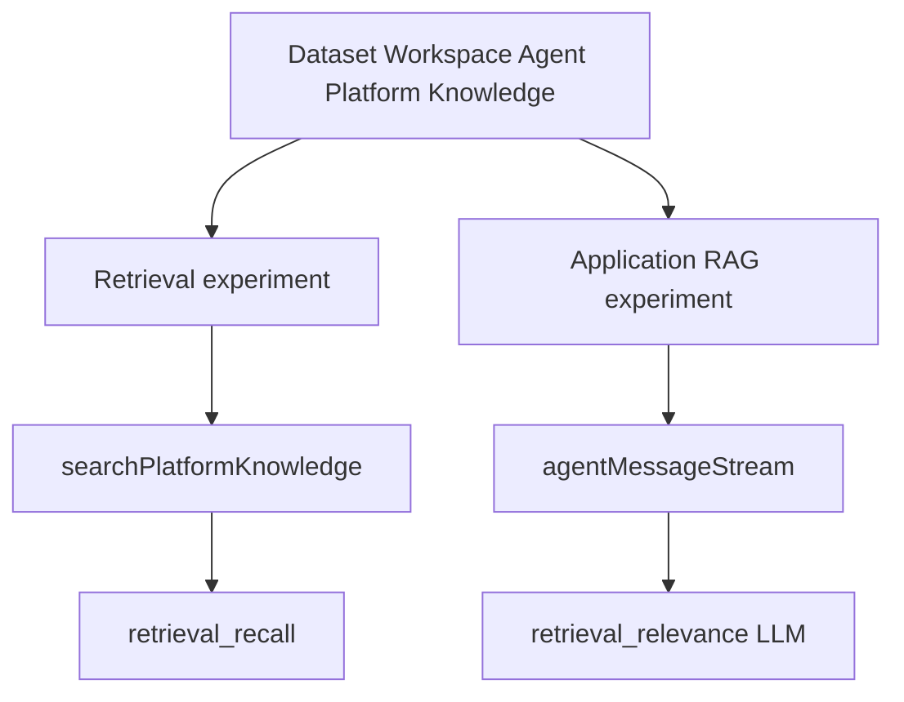
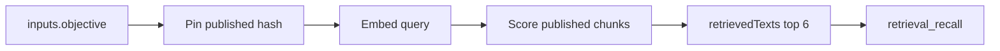

# Workspace agent: platform-knowledge retrieval eval

This document describes how StudyForge evaluates **retrieval** of **Platform agent knowledge** for the workspace agent. It is not a generic LangSmith RAG tutorial. The tutorial pairing of "docs vs question" still applies: see [workspace-agent-platform-knowledge.md](workspace-agent-platform-knowledge.md) for the live RAG experiment that also grades the answer.

Related:

- Index source: [docs/workspace-agent-knowledge-base.md](../workspace-agent-knowledge-base.md)
- Glossary: [CONTEXT.md](../../CONTEXT.md) (**Platform agent knowledge**, **Platform knowledge chunk**, **User knowledge**)
- LangSmith RAG tutorial: [Evaluate a RAG application](https://docs.langchain.com/langsmith/evaluate-rag-tutorial)

## What is being retrieved

The workspace agent has two knowledge paths. This eval covers only the first.

| Path | Store | How the agent uses it | This eval |
| --- | --- | --- | --- |
| **Platform agent knowledge** | `platformAgentKnowledgeDocuments` / `platformAgentKnowledgeChunks` | `searchPlatformKnowledge` injects chunks into the **planner system prompt**. Not a tool. | Yes |
| **User knowledge** | per-user knowledge chunks | `search_knowledge` tool | No |

Queries are the dataset `inputs.objective` strings (the same prompts a user would type in the FAB). Retrieved units are markdown **chunks** of the published policy file, not whole documents.

The indexed doc id is `workspace-agent-knowledge-base`. Seed step 9 in `scripts/seed-setup/setup-seed-data.ts` publishes `docs/workspace-agent-knowledge-base.md` and waits until `indexingStatus` is `indexed` (typically 20 chunks).

## Two experiments, one dataset

LangSmith dataset: `Workspace Agent: Platform Knowledge`.

Local file: `scripts/langsmith-eval/datasets/workspace-agent-platform-knowledge.json`.

Both experiments share examples so compare views line up by `caseId` (`WA-PK-01` … `WA-PK-10`).



| Experiment | Prefix | Target | Retrieval source | Retrieval metric |
| --- | --- | --- | --- | --- |
| Retrieval only | `workspace-agent-pk-retrieval-v1` | In-process `searchPlatformKnowledge` | Direct Admin SDK search | Code: `retrieval_recall` |
| Application / RAG | `workspace-agent-pk-rag-v1` | HTTP `agentMessageStream` | Same search inside `DirectoryAgentService` for that turn | LLM: `retrieval_relevance` plus groundedness on those texts |

They are **not** interchangeable:

- Retrieval-only does **not** run the planner. A high `retrieval_recall` does not prove the reply used the chunks.
- Application LLM `retrieval_relevance` grades semantic relatedness of the **same-turn** chunks to the question. It can score 1 even when a required **phrase** is missing (`retrieval_recall` 0.50).
- Application must not call `searchPlatformKnowledge` a second time in the eval script. That would be a different top-k than the planner saw.

## Indexing (before any experiment)

1. Seed writes `platformAgentKnowledgeDocuments/workspace-agent-knowledge-base` with `status: published`, `publishedContentHash` (SHA-256 of the markdown), then `indexingStatus: indexing`.
2. Functions (`indexPlatformAgentKnowledgeDocument`) split the body with `chunkText`: size **800**, overlap **120** (`knowledge-chunk-utils.ts`).
3. Each chunk is embedded with the seed user's embedding route (OpenRouter multilingual-e5-large in local seed). Chunks store `embedding`, `embeddingUserId`, `embeddingRouteKey`, `sourceContentHash`, `docId`, `text`.
4. Search later **drops** a chunk if `sourceContentHash` is not the current published hash, or if the user's current embedding route does not match `embeddingRouteKey`. Mixing embedding models silently empties retrieval.

Eval runners **pin** the doc at start (`readPlatformKnowledgePin`). The run fails if the doc is missing or not `published` / `indexed`. Experiment metadata records `platformKnowledgeDocumentId` and `publishedContentHash`. Edit the markdown and re-seed: hash changes, scores can move with no agent code change.

## Search algorithm (what both experiments call)

Implementation: `PlatformAgentKnowledgeIndexService.searchPlatformKnowledge` in `libs/backend/agent/src/knowledge/platform-agent-knowledge-index-service.ts`.

1. Load all platform chunks and all **published** knowledge documents.
2. Keep chunks whose `sourceContentHash` matches the published hash for that `docId`.
3. Embed the **query** with the same embedding route as the chunk (`AgentEmbeddingService.embedText`).
4. Score cosine similarity. Drop scores below **`MIN_SIMILARITY` 0.2**.
5. Sort descending. Keep top **`MAX_MATCH_COUNT` 6** (unless `matchCount` is passed; eval does not pass it).

The workspace agent uses the user message as `query`:

```ts
PlatformAgentKnowledgeIndexService.searchPlatformKnowledge({
  userId,
  query: request.message,
});
```

Eval retrieval uses the same call with `userId` `4ZBsEPIUJ4jrlylcXkg7t3sFdPZv` (seed `test@example.com`) and `query` = `inputs.objective`.

## How chunks reach the planner

Matches become a system-prompt block:

```text
Platform knowledge (follow these operational policies when planning generation):
- [Workspace agent knowledge base] <chunk text>
- ...
```

That is the RAG "context" for this agent. There is no separate generator that only sees those chunks. The planner also has tools, memory, thread history, and other prompt sections. `groundedness` therefore grades the **final reply** against retrieved policy chunks, not against the entire prompt.

When `LANGSMITH_EVAL_EMIT_RETRIEVED_TEXTS=true` in `functions/.env.local`, `done.response.retrievedTexts` is the `text` of those same matches. Default off in production. The RAG experiment fails if the field is **missing** (functions not rebuilt). An **empty array** is allowed (no chunks above the similarity floor).

## Retrieval-only experiment (detail)

Script: `scripts/langsmith-eval/experiments/run-platform-knowledge-retrieval.ts`.

Target: `searchPlatformKnowledgeForEval` in `scripts/langsmith-eval/targets/search-platform-knowledge.ts`.



Output shape:

```ts
{
  retrievedTexts: string[];
  documentId: string;
  publishedContentHash: string;
}
```

`scripts/langsmith-eval/shared/emulator-env.ts` is imported first so `FIRESTORE_EMULATOR_HOST` is set before Admin SDK init. The script needs `--tsconfig tsconfig.base.json` because it imports `@study-forge/backend-agent` path aliases.

### Metric: `retrieval_recall`

Code: `retrievalRecallEvaluator` in `scripts/langsmith-eval/evaluators/platform-knowledge.ts`. No LLM.

- Join all `retrievedTexts` (case-insensitive).
- For each `outputs.expectedChunkPhrases` string, count a hit if the phrase appears as a substring.
- Score = hits / number of listed phrases.
- Score **0** if phrases are required and **zero** chunks return.
- Score **1** if the example lists no phrases (none of the current 10 do that).

This is **not** IR recall@k against a labeled relevant-chunk id set. It is "did the top-6 text contain these policy phrases?" Paraphrase in the chunk that omits the listed wording counts as a miss.

### Example labels

| caseId | objective (short) | expectedChunkPhrases |
| --- | --- | --- |
| WA-PK-01 | document from prompt cost | `documentFromPrompt`, `20` |
| WA-PK-02 | quiz cost | `quiz`, `5` |
| WA-PK-03 | flashcard set cost | `flashcards`, `10` |
| WA-PK-04 | create diagram quiz | `diagram quizzes`, `must not directly generate` |
| WA-PK-05 | generate slide deck | `slide decks`, `cannot create slide decks` |
| WA-PK-06 | create sequence quiz | `sequence quizzes`, `must not directly generate` |
| WA-PK-07 | make me a course | `make me a course`, `topic, level, and artifact mix` |
| WA-PK-08 | write HTML in chat | `create_document`, `documentFromPrompt` |
| WA-PK-09 | auto credit limit | `100 credits`, `ask the user to confirm` |
| WA-PK-10 | flashcard source docs | `no more than 5 source documents` |

WA-PK-06 previously scored **0.50** on retrieval-only: top-6 contained `sequence quizzes` but not the exact refuse header `must not directly generate` (the chunk said a close paraphrase). The agent can still refuse from other prompt text, so application `policy_facts` can be 1 while retrieval-only recall is 0.50.

## Application RAG experiment (retrieval side only)

Script: `scripts/langsmith-eval/experiments/run-platform-knowledge-application.ts`. Prefix `workspace-agent-pk-rag-v1`.

Target streams emulator `agentMessageStream` and returns `{ finalReply, retrievedTexts }` from `done`. Same-turn chunks are whatever `searchPlatformKnowledge` returned for that HTTP request.

### Metric: `retrieval_relevance` (LLM)

Tutorial: retrieved docs vs input. No gold answer.

Together GLM-5.2 (`evaluators/rag-llm-judges.ts`): thinking off, structured JSON. Pass if the FACTS contain **any** keyword or semantic overlap with the question. Fail only if the chunks are completely unrelated. Score **0** with an explicit comment if `retrievedTexts` is empty.

This bar is **looser** than `retrieval_recall`. Credit-table chunks plus a refuse question can still score 1 if "quiz" / "workspace agent" appear. Use recall for phrase gates; use the LLM for "did we retrieve something on-topic?"

### Metric: `groundedness` (depends on retrieval)

Compares `finalReply` to the same `retrievedTexts`. Extra true policy that is **not** in those six chunks can fail groundedness even when `correctness` is 1 (example: quiz cost reply adding "separately from document and flashcard" when that sentence was not in the retrieved slice).

## How to run

Emulators: `--project` must match `NX_PUBLIC_FIREBASE_PROJECT_ID`. Seed indexes the knowledge file.

```bash
npx tsx scripts/seed-setup/setup-seed-data.ts
npx tsx scripts/langsmith-eval/datasets/upload-platform-knowledge.ts
npx tsx --tsconfig tsconfig.base.json scripts/langsmith-eval/experiments/run-platform-knowledge-retrieval.ts
```

Smoke: `LANGSMITH_EVAL_MAX_EXAMPLES=2`.

Retrieval-only does **not** need `LANGSMITH_EVAL_EMIT_RETRIEVED_TEXTS` or `TOGETHER_AI_API_KEY`. The RAG application experiment needs both (emit flag on functions, Together key for judges).

Needs `LANGSMITH_API_KEY` and `LANGSMITH_PROJECT`. Firestore emulator must hold the published index (seed after a fresh emulator).

## How to read a row

1. Open the retrieval experiment. Check `retrieval_recall` comment: `Matched H/N phrases in K chunk(s)`.
2. Inspect `outputs.retrievedTexts`. Confirm whether the missed phrase exists elsewhere in the 20-chunk file (chunking / top-6) vs a bad embedding.
3. Compare the same `caseId` on `workspace-agent-pk-rag-v1`. `retrieval_relevance` 1 with recall 0.50 means the LLM liked the neighborhood, the phrase gate did not.
4. If application `retrievedTexts` and retrieval-only texts disagree, check emit flag, functions rebuild, and that both used the same published hash.

Do not attach retrieval judges as **online** evals on production `workspace-agent` traces. Production `done` events do not include `retrievedTexts` by default.

## Files

| Path | Role |
| --- | --- |
| `scripts/langsmith-eval/experiments/run-platform-knowledge-retrieval.ts` | `evaluate()` entry for retrieval-only |
| `scripts/langsmith-eval/targets/search-platform-knowledge.ts` | Pin + `searchPlatformKnowledge` |
| `scripts/langsmith-eval/evaluators/platform-knowledge.ts` | `retrieval_recall` |
| `scripts/langsmith-eval/evaluators/rag-llm-judges.ts` | `retrieval_relevance` on the live RAG run |
| `scripts/langsmith-eval/datasets/workspace-agent-platform-knowledge.json` | Phrases and gold criteria |
| `libs/backend/agent/src/knowledge/platform-agent-knowledge-index-service.ts` | Index + search |
| `libs/backend/agent/src/directory-agent-service.ts` | Same-turn search into planner prompt |
| `scripts/seed-setup/seed-workspace-agent-knowledge.ts` | Publish + wait for index |
